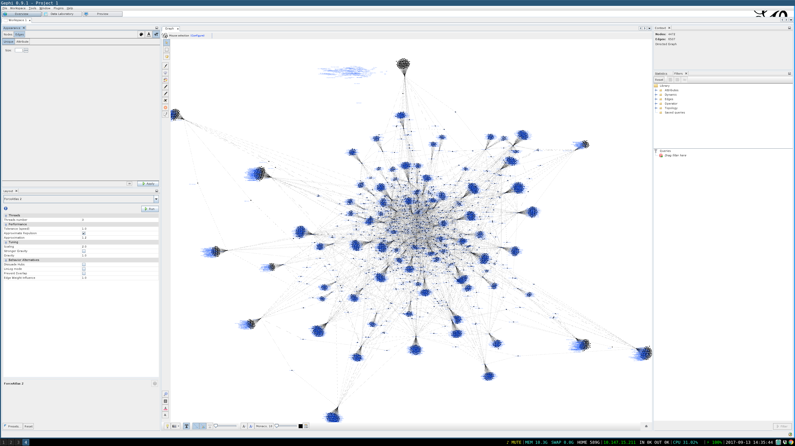
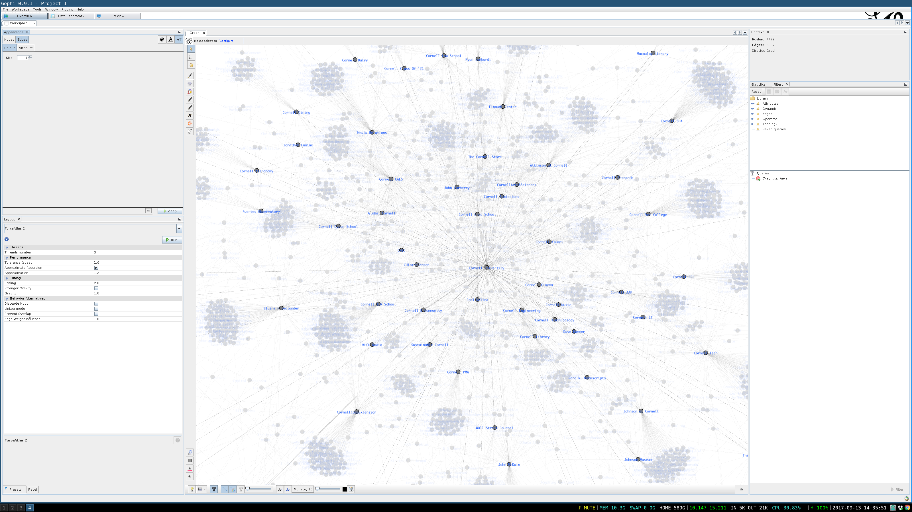

## 22:43
My networks blog is due in 25 hours and 20 minutes. Lets see if I can do something interesting with facebook and Cornell students in that time. I think exploring the Cornell Group is a good start, going to try to get the list of members via graph api, maybe see if I can discover other cornell groups from that list.

## 22:55
Tricker than I hoped for, but better than I expected. Most of interesting Cornell groups are either "pages" or closed "groups". You can view the membership of a closed group you're in, but querying users does not list the closed groups they belong to.

This is the query that list member of the Cornell Class of 2019 Group: 439603729512342?fields=members{name}

## 23:23

I love that facebook is taking a harder line on privacy. I hate that it's getting in my way. Turns out they cracked down on the API so users cannot see the members of groups or pages unless they're the admin. I haven't posted on facebook in over a year, so needless to say I'm not admin-admin-admin across the board.

But what they do have is my friends list, each of my friend's friends list. And each of my friends page likes. I do NOT, however, have my friends friends likes. That means I know who likes who in the greater Cornell Community (I'm guessing it's pretty connected) but not *what* they like. That'll have to do for now.

Wait, scratch that, facebook only allows you to see friends who have also used the graph API, which means all my developer friends---but not nearly enough. This might be a dead end without scrapping facebook which I'm gun-shy to do.

A casualty of Facebook's newfound morality: https://www.wolframalpha.com/facebook/

## 23:56

F*** it.

```
mv networks-facebook networks-twitter
```

## 8:29

Just woke up. Before I fell asleep I found twitter-python and networkx for python3 and set up my API token. Everything on twitter seems public and their rate limiting doesn't seem that bad.

## 9:54

Twitter has pretty strict rate-limiting on it's friendslist lookup (1 per minute on average), but getting 200 most recent tweets is much higher (about 50/minute). Honestly, that actually sounds like a more interesting data set because it naturally assigns important-values to relationships.

A search of recent mentions from Cornell University and all of their recent mentions tool a minute, now I'll look at that data and see what I've got.

## 12:06

Every. Single. Time.

Every time I need to visualize a network I lose a couple hours of my life trying to set up something I like. Went through a couple depreciated 3d python wrappers, then plotly, then graphvis, then matplotlib, back to graphvis, now looking at graphi.

Also had to clean up how I store data from the API to keep user information.

## 12:28

Graphi doesn't scale it's GUI, and I'm on a 4k 13-in screen.

Nevertheless, we have what we need. A rough model of the Cornell Community. Interestingly, these nodes represent institutions here at Cornell and the edges represent their public interactions.





## 14:36

Took a break but now I'm back. I can't do this all day, so let's settle on trying to answer 3 questions as quickly as possible.

1. Can I find a property of the Cornell specific subgraph that does not hold for the nodes? A way to distinguish nodes like "Cornell Arts and Science" and "Cornell Grad School" from "Bill Clinton"

2. ~~What clusters are there on this graph? Maybe we can separate out the Colleges?~~

3. ~~Is there a hierarchy? I see this notion of "smaller" institutions such as "Cornell Music" and "Cornell Library", compared to "Cornell University". Is there some recursive structure similar to an org chart?~~

Keep in mind, I have no idea what I'm doing. Making it up as I go.

**Question 1:** The idea must be that the Cornell Community is more closely knit to itself then other nodes are. Unfortunately, with only two hops of breadth, it's going to be hard to find deep patters.

It would be nice to have some sliding-scale of confidence for if a node is in the community or not based on how many of it's connections are to other "Cornell" nodes. Unfortunately, we only have all the neighbors for nodes which neighbor "Cornell University", which will make that idea nearly impossible for the second hop nodes. It would also be nice to take advance of the directedness of this graph.

In general, harmonic functions are nice for this kind of task, so I'll just do random walk from each node and see how likely it is to reaches "Cornell University" before leaving the graph. To allow the walk to leave the graph I'll add $x$ edges to each outer (2 hops from "Cornell University") node, where $x$ is the average degree of the graph. Rough, I know, but what else can I do?

Hopefully there'll be some threshold where suddenly the probability of reaching "Cornell University" drops drastically. That would look like a steep slope on a cumulative distribution plot. I'm going to predict that the highest slope on that diagram between the 10th and 90th percentiles should be the threshold for being in the Cornell community or not.

Actually, changing the value of $x$ is going to uniformly reduce the escape probabilities (citation needed) so I can just set it to 1 and have one less arbitrary value.

## 17:45
Got some time to sink into 1. I'll need to write my own harmonic function solver. Real pain but good experience.

## 20:37
Totally worth it. Also linear algebra is a pain in the butt.

[Here's the histogram I came up with.](data/histogram1.html)

Good candidates for probability thresholds are 0.030 and 0.024. Lets sort the nodes and see how I did.

[Here are the results.](data/try1.txt)

It definitely over favors nodes that are close to Cornell and don't talk to many people. Hence you get Dave. The problem seems to be that humans have more intuitive knowledge about what nodes belong to Cornell just by their names. We look at the connections to Cornell and see one large component, but this harmonic function isn't looking for one large component, for all it knows there are several large not-Cornell components. Fundamentally we can't fix that, but we can give the algorithm a bit of a push. Lets anchor a few more nodes as in the community. I'll pick these:

* CornellArts&Sciences
* Cornell Engineering
* Cornell HumanEcology

Of course we could just add anything with "Cornell" in it's name, but let's not make it too easy!

Well then we get [this histogram](data/histogram2.html) and [this set of probabilities](data/try2.txt).

Fundamentally the problem seems to be that this "random walk" doesn't reappraise the know grown truth. It considers the initial nodes to be "Cornell's Community" and doesn't go from there. It also assigns no value to being close to a large number of "Cornell-like" groups, only that a large percentage of your relations are with "Cornell-like" groups (which is why users with very few relations top the charts, especially at the 0.5 mark). I also take it back, the value of $x$ very clearly matters.

~~Ugg, turns out I don't have time for~~ I'll leave the other 2 questions as an exercise to the reader.

Welp, that's all I have time for today! Hope someone got something out of it!
